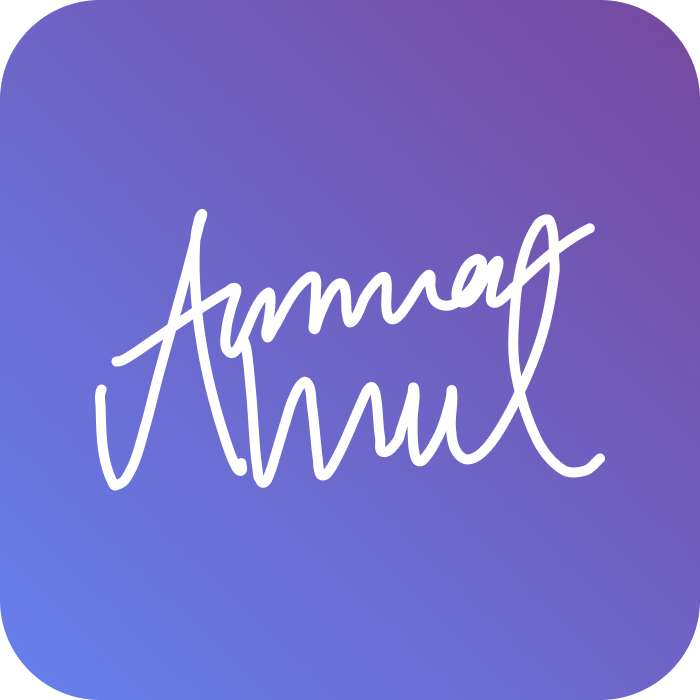
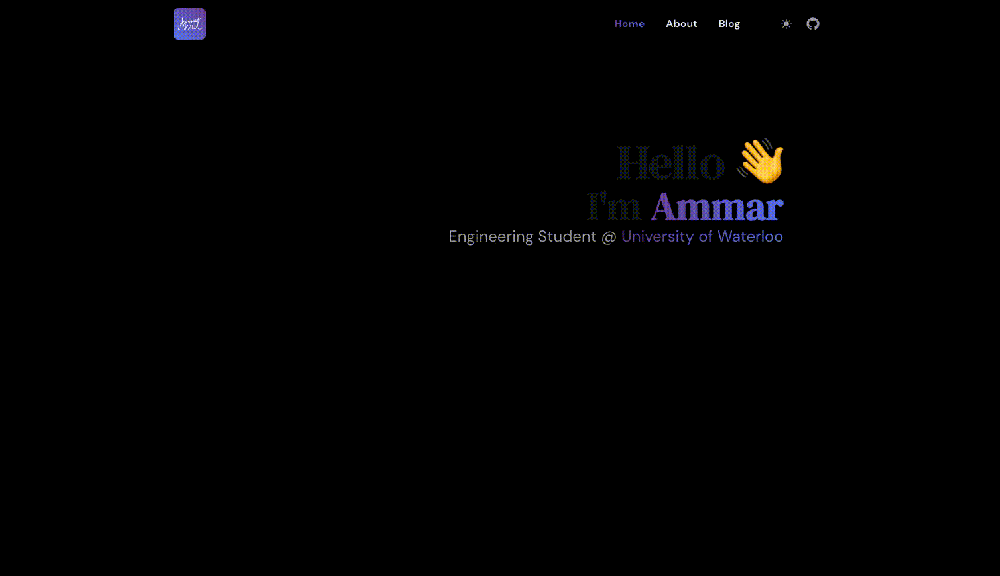

  
  <h1>ammarahmed.ca</h1>
  
  

    After re-making and re-designing my personal website hundreds of times, I have finally arrived at a design which I quite enjoy. Take a scroll at <a href="https://ammarahmed.ca">ammarahmed.ca</a>
  

## 👨‍💻 Tech Stack

A high-level overview of the tech stack this website uses:

**Front-end**

- [React](https://reactjs.org/) with [TypeScript](https://www.typescriptlang.org/) is used for the functionality of the website.
- [TailwindCSS](https://tailwindcss.com/) is used as the UI framework.
- [NextUI](https://nextui.org/) is used to create the standardized and aesthetic UI.
- [Apollo Client](https://www.apollographql.com/docs/react/) is used to handle making GraphQL requests.

**[Back-end](https://github.com/ammar-ahmed22/ammarahmedca-server)**

- [Node.js](https://nodejs.org/en/) with [TypeScript](https://www.typescriptlang.org/) is used for the server environment.
- [Notion](https://www.notion.so/product?fredir=1) is used to persist web content (database).
- [Notion API](https://developers.notion.com/) is used to connect the server to Notion
- [TypeGraphQL](https://typegraphql.com/docs/getting-started.html) is used to structure the [GraphQL](https://graphql.org/) API with TypeScript.

**Hosting**

- [Google Firebase](https://firebase.google.com/) is used for the client-side hosting
- [Fly.io](https://fly.io/docs/) is used for the server-side hosting.

## 🔧 Notable Features

### Content Management

Web content such as blog posts, project content, skills etc. are written, edited and persisted in Notion. Automatically updated whenever changed in Notion

### Light/Dark Mode

Switching between light and dark mode.

### Continous Deployment

Client-side and server-side deployment is set-up automatically with `production` branch pushes. SMS Notifications are sent to me after deployment finishes using Twilio.

### Skill Charts

Aesthetic radar charts created for skills using [recharts](https://recharts.org/en-US)

## 🎨 Design Reference

#### Colors

| Color     | Hex                                                              |
| --------- | ---------------------------------------------------------------- |
| Primary   |  #72499D |
| Secondary |  #627BE9 |

#### Fonts

| Type    | Font                                                                            |
| ------- | ------------------------------------------------------------------------------- |
| Heading | [DM Serif Display](https://fonts.google.com/specimen/DM+Serif+Display), _serif_ |
| Body    | [DM Sans](https://fonts.google.com/specimen/DM+Sans), _sans-serif_              |
| Mono    | [DM Mono](https://fonts.google.com/specimen/DM+Mono), _monospace_               |

## 💬 Feedback

If you have any feedback, please reach out to me at ammar.ahmed1@uwaterloo.ca.

## 📋 Articles/References

#### Docs

- [TailwindCSS](https://tailwindcss.com/docs/installation)
- [Next UI](https://nextui.org/docs/guide/introduction)
- [Apollo GraphQL](https://www.apollographql.com/docs/)
- [Notion API](https://developers.notion.com/reference/intro)
- [TypeGraphQL](https://typegraphql.com/docs/getting-started.html)
