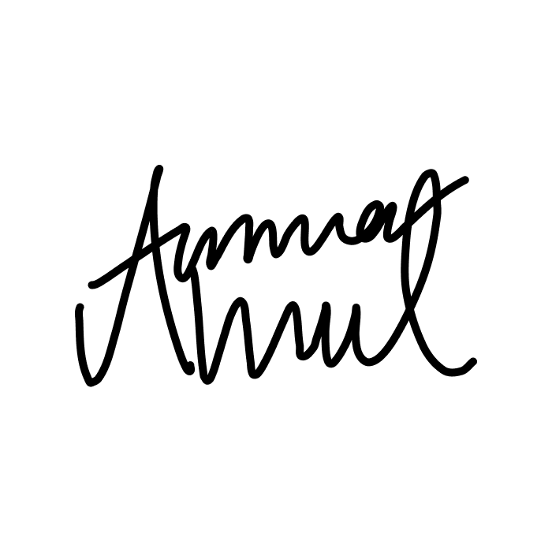

  
  <h1>ammarahmed.ca</h1>
  

    After re-making and re-designing my personal website hundreds of times, I have finally arrived at a design which I quite enjoy. Take a scroll at <a href="https://ammarahmed.ca">ammarahmed.ca</a>
  

## 👨‍💻 Tech Stack

A high-level overview of the tech stack this website uses:

**Front-end**

- [React](https://reactjs.org/) with [TypeScript](https://www.typescriptlang.org/) is used for the functionality of the website.
- [TailwindCSS](https://tailwindcss.com/) is used as the UI framework.
- [ShadCN UI](https://ui.shadcn.com) is used to create the standardized and aesthetic UI.

**[Back-end]**

- [NextJS](https://nextjs.org) is used as the web framework to allow for SSR (server-side rendering)
- [Notion](https://www.notion.so/product?fredir=1) is used to persist web content (database).
- [Notion API](https://developers.notion.com/) is used to connect the server to Notion

**Hosting**

- [Vercel](https://vercel.com) is used for the client and server hosting

## 🔧 Notable Features

### Content Management

Web content such as blog posts, project content, skills etc. are written, edited and persisted in Notion. Automatically updated whenever changed in Notion

### Animations

Tasteful animations and interactions implemented throughout the website using framer motion.

### Light/Dark Mode

Switching between light and dark mode.

### Continous Deployment

Client-side and server-side deployment is set-up automatically with `production` branch pushes. 

## 💬 Feedback

If you have any feedback, please reach out to me at ammar.ahmed1@uwaterloo.ca.
