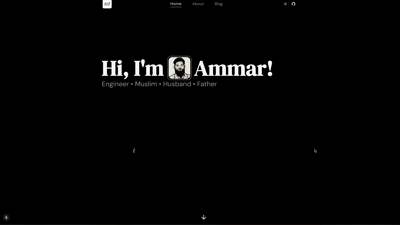

00001| 

00004| 
00005| <h1>ammarahmed.ca</h1>
00006| 
00007| 

00008| After re-making and re-designing my personal website hundreds of times, I have finally arrived at a design which I quite enjoy. Take a scroll at <a href="https://ammarahmed.ca">ammarahmed.ca</a>
00009| 

00010| 

00011|
00012| ## 👨‍💻 Tech Stack
00013|
00014| A high-level overview of the tech stack this website uses:
00015|
00016| **Front-end**
00017|
00018| - [React](https://reactjs.org/) with [TypeScript](https://www.typescriptlang.org/) is used for the functionality of the website.
00019| - [TailwindCSS](https://tailwindcss.com/) is used as the UI framework.
00020| - [ShadCN UI](https://ui.shadcn.com) is used to create the standardized and aesthetic UI.
00021|
00022| **[Back-end]**
00023|
00024| - [NextJS](https://nextjs.org) is used as the web framework to allow for SSR (server-side rendering)
00025| - [Notion](https://www.notion.so/product?fredir=1) is used to persist web content (database).
00026| - [Notion API](https://developers.notion.com/) is used to connect the server to Notion
00027|
00028| **Hosting**
00029|
00030| - [Vercel](https://vercel.com) is used for the client and server hosting
00031|
00032| ## 🔧 Notable Features
00033|
00034| ### Content Management
00035|
00036| Web content such as blog posts, project content, skills etc. are written, edited and persisted in Notion. Automatically updated whenever changed in Notion
00037|
00038| ### Animations
00039|
00040| Tasteful animations and interactions implemented throughout the website using framer motion.
00041|
00042| ### Light/Dark Mode
00043|
00044| Switching between light and dark mode.
00045|
00046| ### Continous Deployment
00047|
00048| Client-side and server-side deployment is set-up automatically with `production` branch pushes.
00049|
00050| ## 🎨 Design Reference
00051| #### Fonts
00052|
00053| | Type | Font |
00054| | ------- | ------------------------------------------------------------------------------- |
00055| | Heading | [DM Serif Display](https://fonts.google.com/specimen/DM+Serif+Display), _serif_ |
00056| | Body | [DM Sans](https://fonts.google.com/specimen/DM+Sans), _sans-serif_ |
00057| | Mono | [DM Mono](https://fonts.google.com/specimen/DM+Mono), _monospace_ |
00058|
00059| ## 💬 Feedback
00060|
00061| If you have any feedback, please reach out to me at ammar.ahmed1@uwaterloo.ca.
Shadow was here!
